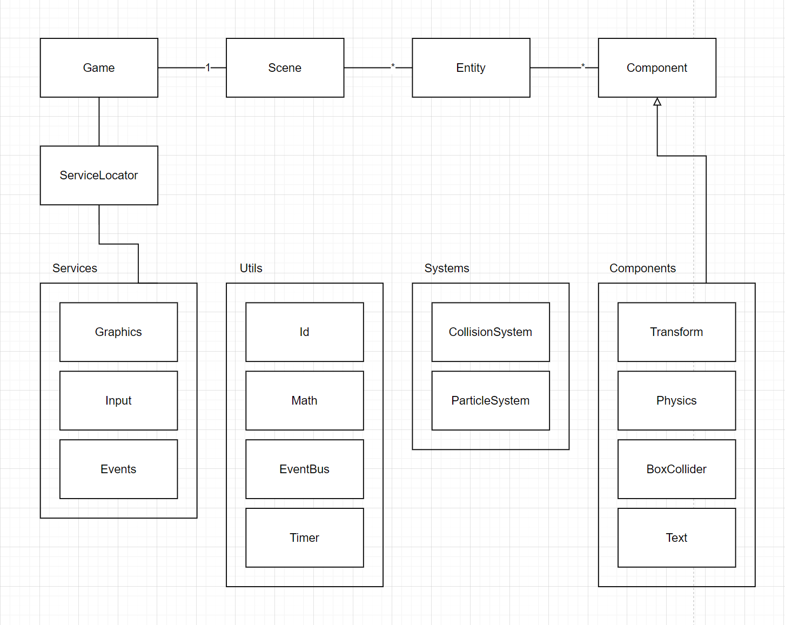
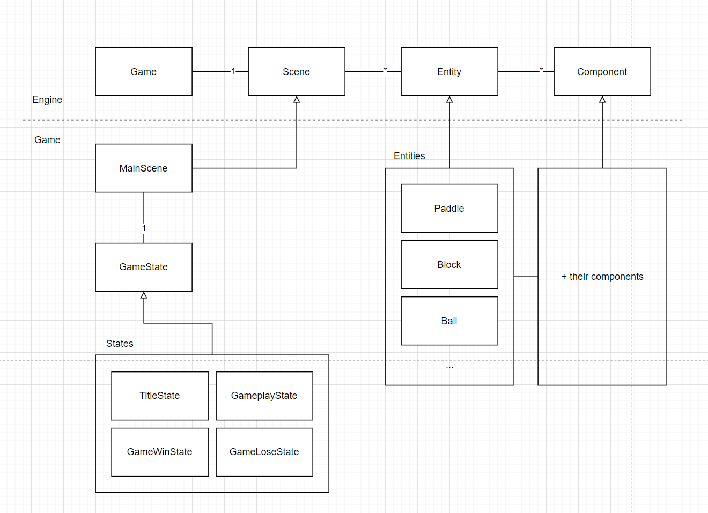
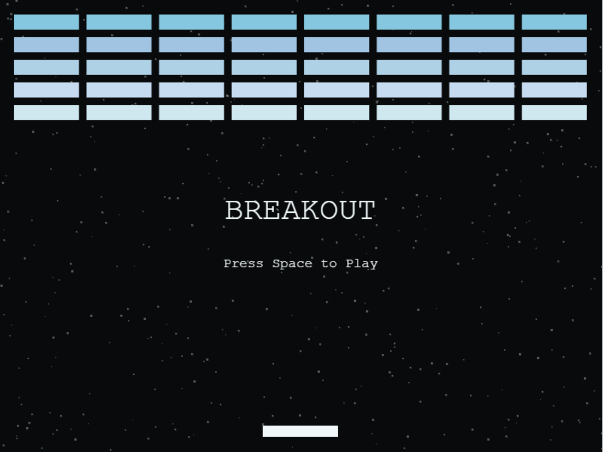

# Breakout   

Breakout implemented in TypeScript using Canvas API.

View demo [here](https://lmalmber.github.io/breakout/).

## Setup

1. Run `npm install`
2. Run `npm run dev`

## Architecture

### Engine

### Game

## Screenshot

